# SkeletalMeshDestruction
> Language: [English](README.md), [中文](README-CN.md)
> 
虚幻引擎中的骨骼网格体战损与肢解系统，可轻松实现角色在战斗中的受损效果和肢解效果。

## 简介
在本解决方案中，主要提供两种骨骼网格体破坏效果：

1. **战损效果**：可以对角色骨骼网格体进行局部损坏，模拟战斗中的擦伤、撕裂等效果。
2. **肢解效果**：对指定角色部位进行肢解处理，模拟角色在战斗中被切割或断裂的效果。

插件提供了多种配置选项，允许开发者根据需要调整效果的细节，如损坏程度、肢解部位等。同时，着重考虑了性能优化，确保在复杂场景中也能流畅运行。

## 概念引入
### Degradation Level Of Detail (DLOD)

该概念借用了LOD（Level Of Detail）的思想，DLOD（Degradation Level Of Detail）是一个用于描述骨骼网格体部位损坏细节的概念。开发者可以为同一部位制作不同损坏程度的模型，DLOD等级越高，表示损坏程度越严重。通过这种方式，可以在游戏中实现模型级别的细致损坏效果。

为了得到更好的性能和更少的贴图内存占用，在制作DLOD模型时，有一些特有的技巧，这部分内容将在后续专门的文档中详细介绍。

## 快速上手
1. 创建Skeletal Mesh Destruction Config资产

    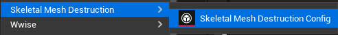

2. 打开资产，看到以下默认配置：

    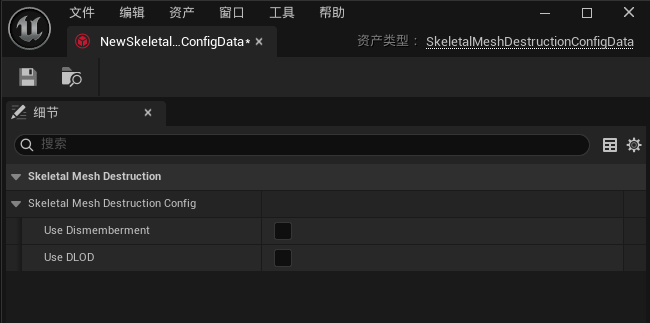

    在这里，你可以选择要启用的特性，比如只需要使用肢解特性，那么仅勾选`Use Dismemberment`即可。为了示范，我们勾选全部。

    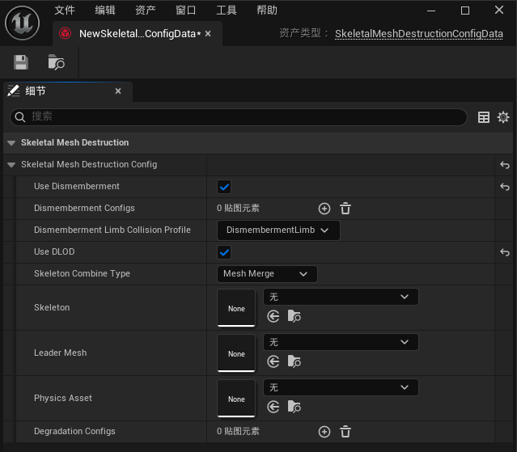

3. 详细配置我们在后面细节中介绍，这里，我们暂时先假定我们已经完成了所有配置。接下来，便是如何使用它，我们首先为需要应用战损效果的角色Actor添加一个`SkeletalMeshDestruction`组件。

    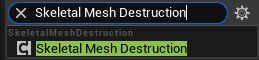

    注意，该组件必须和待应用战损效果的骨骼网格体组件处于同一个Actor中。

4. 在`SkeletalMeshDestruction`组件的属性面板中，选择我们刚才创建的`Skeletal Mesh Destruction Config`资产。

    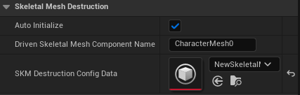

    同时，需要填写目标骨骼网格体组件的名字，该组件必须是一个`SkeletalMeshComponent`类型的组件，战损系统会在初始化时，自动合并模型并将其设置到该组件上。

    默认情况下，SkeletalMeshDestruction组件会自动初始化，但如果你需要手动控制初始化时机，可以将`Auto Initialize`属性设置为`false`，然后在蓝图或C++代码中调用`InitializeSkeletalMesh()`方法来手动初始化。

5. 现在，我们可以为角色添加战损效果了。方法很简单，关键函数只有以下几个：

    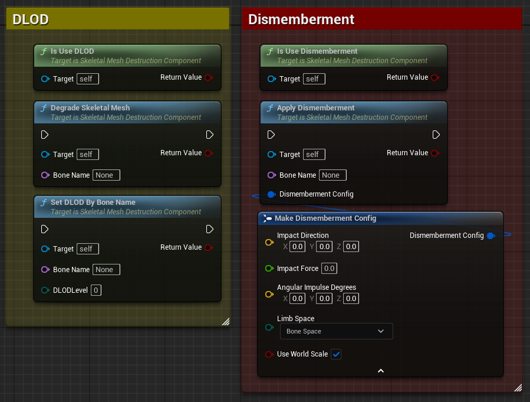

    - `Degrade Skeletal Mesh`: 该函数可以让指定骨骼部位的骨骼网格体DLOD等级+1，这可以使得该部位的损坏效果更加明显。
    - `Set DLOD By Bone Name`: 该函数可以直接设置指定骨骼部位的DLOD等级，允许开发者精确控制每个部位的损坏程度。

    - `Apply Dismemberment`: 该函数可以对指定骨骼部位进行肢解, 你可以传入Dismemberment Config结构体来控制肢体块分离后，应用的线速度冲力和角速度冲力。在这里，你可以指定要应用的空间坐标系，现系统支持骨骼坐标系、组件坐标系和世界坐标系。

    如果你需要在动画中应用战损效果，除了可以自己编写AnimNotify，你还可以直接使用插件提供的内置AnimNotify `Apply SKM Destruction`，它可以在动画播放时自动应用战损效果，同时支持Dismemberment和DLOD。当然，前提是动画所播放的的骨骼网格体组件的Owning Actor中必须有`SkeletalMeshDestruction`组件。

    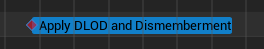

    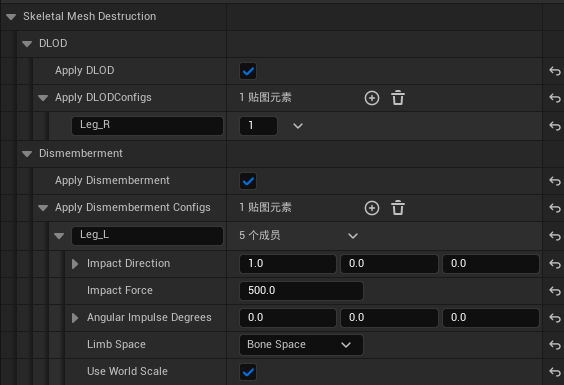

## 资产配置细节

创建完`Skeletal Mesh Destruction Config`资产后，你可以在资产的属性面板中进行详细配置。以下是一些关键配置项的说明：

### Dismemberment
只要勾选了`Use Dismemberment`选项，就会启用肢解效果。你可以在Dismemberment Configs中配置可肢解的骨骼部位以及肢体模型：

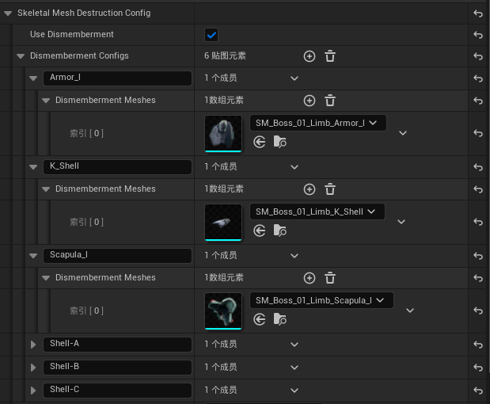

也许你会发现，每个骨骼可以对应多个肢体模型，这部分算是为以后的扩展预留的接口。当前版本中，只有一个肢体模型会被使用。未来，可能会提供随机、上下文肢体选择等功能。

最后的Dismemberment Limb Collision Profile参数用于配置肢体块的碰撞预设，你可以根据需要选择合适的碰撞预设。

### DLOD
勾选`Use DLOD`选项后，你可以使用DLOD特性。要支持DLOD，你需要确保按照模块化的方式去制作和处理骨骼网格体。具体来说，你需要明确那些部位需要DLOD特性，哪些不需要。接下来，就如同制作普通的模块化骨骼网格体角色一样，将这些部位拆分出来，并使用同一个骨架。所以，在这里，你需要决定一个“Leader”骨骼网格体，它是完整骨骼网格体中不变（不需要DLOD）的那部分，就算角色全身都需要DLOD特性，也同样需要有一个Leader骨骼网格体（比如你可以导出一个“只包含包含单个面”的骨骼网格体，只要不穿帮就行）。

对于普通模块化骨骼来说，到这里就已经结束了，剩下的工作就只是将他们重新组合成一个完整的骨骼网格体。但DLOD的工作还没有结束，接下来，你需要为每个需要DLOD特性的骨骼部位制作不同损坏程度的模型，例如：

| DLOD 0 | DLOD 1 |
|:----:|:----:|
| 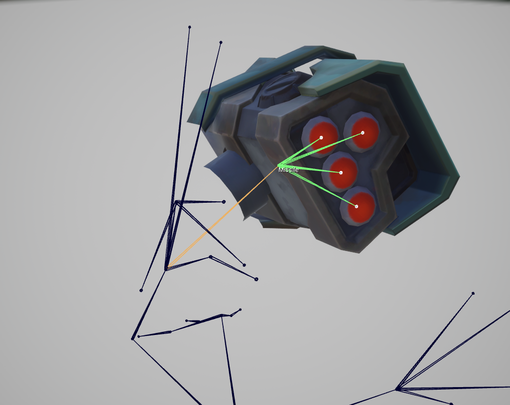 | 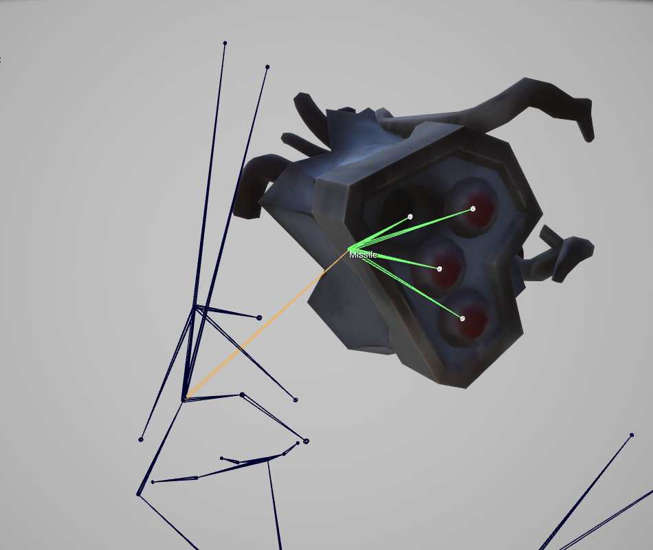 |

得到DLOD资产后，接下来就是将它们添加到`Skeletal Mesh Destruction Config`资产的Degradation Configs中：

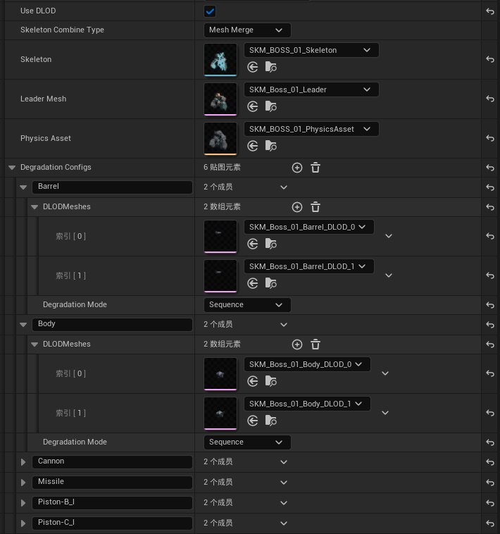

每个Degradation Config都需要指定一个骨骼名称（Bone Name），而在它对应的DLODMeshes数组中，数组下标表示DLOD等级，请依次添加对应的DLOD模型。

配置完DLOD数组后，下方还有一个额外的Degradation Mode参数，它允许你自定义该DLOD的工作模式。该模式参数主要提供给`Degrade Skeletal Mesh`函数使用，目前支持以下两种模式：
- **Sequence**：从小到大递进应用DLOD效果，依次增加DLOD等级。
- **Random**：随机应用DLOD效果。

大部分情况下，你可以使用默认的`Sequence`模式，Random模式主要用于一些特殊的效果，比如随机擦伤等。增加此参数主要是为后续可能的扩展预留接口。

最后，剩下我们的“Leader”，你需要指定一个Leader骨架、骨骼网格体、物理资产。

指定骨架和骨骼网格体很容易理解，但物理资产的指定可能需要一些额外的说明。为了避免创建大量零碎的物理资产，你可以导入一个完整的角色骨骼网格体模型，并用它生成一个完整的物理资产。这个物理资产将作为合并后的骨骼网格体的物理资产使用。不必担心肢解后肢解部位物理碰撞依然存在，系统会自动处理好一切，肢解过后，该部位的物理碰撞将会被移除。

而提到合并网格体，在虚幻引擎中，除了最新的Mutable框架，传统的合并方式有三种，Epic官方有做了介绍：[Working with Modular Characters](https://dev.epicgames.com/documentation/en-us/unreal-engine/working-with-modular-characters-in-unreal-engine)。在这里，系统继承了两种方式，Skeletal Mesh Merge和Leader Pose Component，具体要使用哪种方式可以通过配置Skeletal Combine Type来选择。我特别推荐使用Mesh Merge方式，因为在大部分情况下，他的性能表现都会更好，除非你需要不断的在短时间内大量生成新的带DLOD特性的角色。但就我认为，一般使用DLOD特性的角色，都是一些比较重要的角色，通常不会频繁生成新的角色，所以Mesh Merge方式是更好的选择。重要性较小的角色，通常使用Dismemberment特性即可。

## 技术细节
### 关于肢解
肢解效果并非使用简单的骨骼网格体分离，而是通过隐藏骨骼网格体上的骨骼，并在相同位置生成预先准备好的静态网格体来实现的。这样可以避免在运行时进行复杂的网格体分离操作，从而提高性能。

#### 生命周期
肢体块在生成之后，会自行维护其自身的生命周期。默认情况下，肢体块会在生成后开始进行物理模拟，并在一段时间后进入休眠状态，不再参与物理计算。

#### 物理避让阶段
为了得到更好的视觉效果，保留肢体块在肢解瞬间向周围发射的动态效果，系统会在肢体块生成后的一段时间内，禁用肢体块与周围环境（包括其他肢体块）的碰撞检测。这样既可以避免肢体块在生成瞬间与环境发生碰撞造成的不自然效果，也可以保留肢体块的动态运动轨迹，甚至在同一位置生成多个重叠的肢体块都能得到良好的效果。在物理避让阶段结束后，肢体块会恢复与环境的碰撞检测，得到物理准确的效果。

而物理避让阶段的具体时间长度其实跟肢体块的初速度有关，初速度越大，物理避让阶段的时间越短。他们之间呈反比例关系。而我们规定，物理避让时间最少为一帧，即使初速度为0，肢体块也会在一帧后才恢复与环境的碰撞检测。由此，我们只需要定义初速度的范围以及最大物理避让时间，即可计算出物理避让阶段的时间长度。你可以在设置选项中配置这一部分内容：

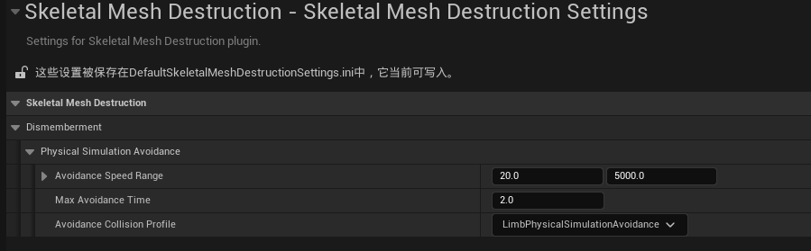

值得注意的是，物理避让期间，并不会关闭模型组件的碰撞，因为这在虚幻中会导致物理模型也同样被关闭，所以作为替代方案，请自行定义一个碰撞预设，如PhysicalSimulationAvoidance，并手动勾选需要忽略的碰撞通道。

## 关于PR
如果你对该系统有任何改进建议或想法，欢迎提交PR！我们非常欢迎和感谢社区的参与和贡献。
请确保你的PR遵循以下几点：
1. PR应包含清晰的描述，说明你所做的更改和目的。
2. PR应遵循代码风格和规范，以保持代码的一致性和可读性。
3. PR应包含必要的文档更新，以便其他人能够理解你的更改。

## 许可证
本项目采用MIT许可证，详情请查看[LICENSE](LICENSE)文件。