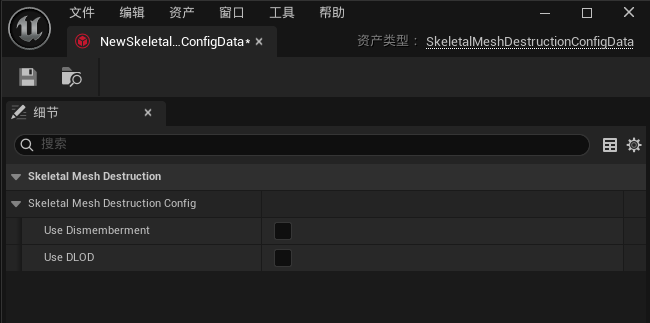
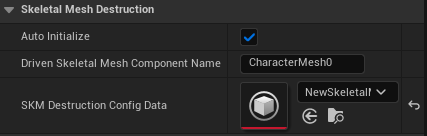
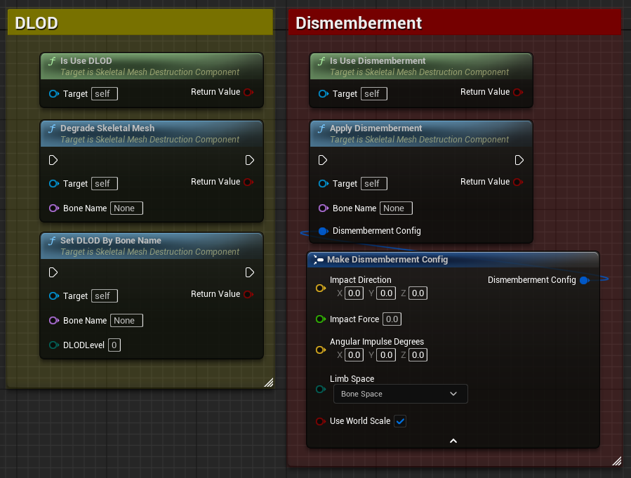
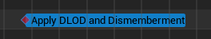
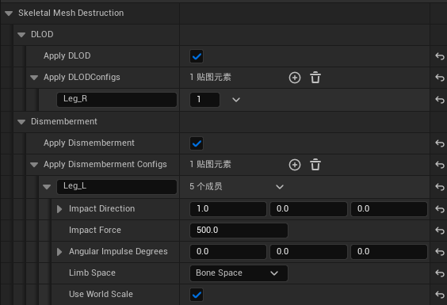
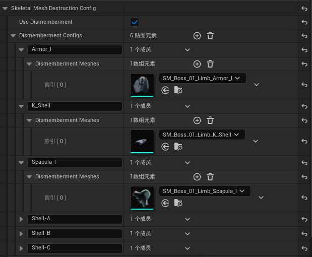
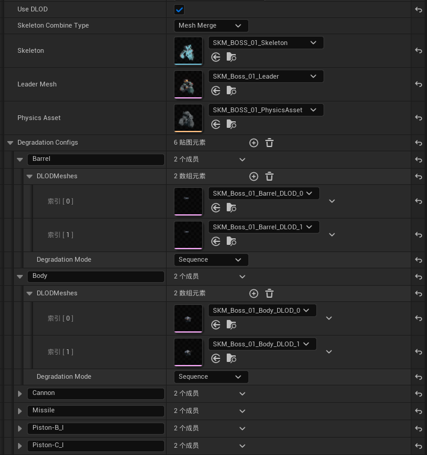
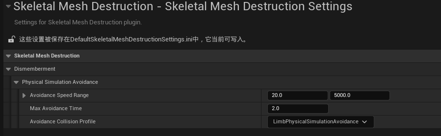

# SkeletalMeshDestruction
> Language: [English](README.md), [中文](README-CN.md)
> 
A skeletal mesh degradation and dismemberment system for Unreal Engine, enabling easy implementation of damage and dismemberment effects for characters during combat.

## Introduction
This solution primarily provides two types of skeletal mesh destruction effects:

1. **Damage Effects**: Allows localized damage to skeletal meshes, simulating effects such as scratches and tears during combat.
2. **Dismemberment Effects**: Enables dismemberment of specific body parts, simulating cutting or breaking effects during combat.

The plugin offers various configuration options, allowing developers to adjust the details of the effects, such as damage severity and dismemberment locations. Performance optimization has been a key consideration to ensure smooth operation even in complex scenes.

## Concept Introduction
### Degradation Level Of Detail (DLOD)

This concept borrows from the idea of LOD (Level Of Detail). DLOD (Degradation Level Of Detail) describes the level of detail for damage on skeletal mesh parts. Developers can create models with varying levels of damage for the same part. A higher DLOD level indicates more severe damage. This approach enables detailed damage effects at the model level in games.

To achieve better performance and reduce texture memory usage, there are specific techniques for creating DLOD models. These techniques will be detailed in a dedicated document later.

## Quick Start
1. Create a Skeletal Mesh Destruction Config asset.

    

2. Open the asset to see the following default configuration:

    

    Here, you can select the features to enable. For example, if you only need the dismemberment feature, simply check `Use Dismemberment`. For demonstration purposes, we will enable all features.

    

3. Detailed configuration will be introduced later. For now, assume all configurations are complete. Next, add a `SkeletalMeshDestruction` component to the actor that requires damage effects.

    

    Note that this component must be in the same actor as the skeletal mesh component to which the damage effects will be applied.

4. In the `SkeletalMeshDestruction` component's property panel, select the `Skeletal Mesh Destruction Config` asset you just created.

    

    Additionally, specify the name of the target skeletal mesh component, which must be of type `SkeletalMeshComponent`. The destruction system will automatically merge the models and set them to this component during initialization.

    By default, the SkeletalMeshDestruction component initializes automatically. If you need to control the initialization timing manually, set the `Auto Initialize` property to `false` and call the `InitializeSkeletalMesh()` method in Blueprint or C++ code to initialize manually.

5. Now, you can add damage effects to the character. The key functions are as follows:

    

    - `Degrade Skeletal Mesh`: Increases the DLOD level of the specified skeletal part, making the damage effect more pronounced.
    - `Set DLOD By Bone Name`: Directly sets the DLOD level for a specified skeletal part, allowing precise control over the damage level of each part.
    - `Apply Dismemberment`: Dismembers the specified skeletal part. You can pass a Dismemberment Config structure to control the linear and angular velocity impulses applied to the separated limb. You can also specify the coordinate space to use, with support for bone space, component space, and world space.

    If you need to apply damage effects during animations, you can either write your own AnimNotify or use the built-in AnimNotify `Apply SKM Destruction` provided by the plugin. This AnimNotify automatically applies damage effects during animation playback and supports both Dismemberment and DLOD. However, the skeletal mesh component playing the animation must belong to an actor that contains a `SkeletalMeshDestruction` component.

    

    

## Asset Configuration Details

After creating the `Skeletal Mesh Destruction Config` asset, you can configure it in detail in the asset's property panel. Below are explanations of some key configuration options:

### Dismemberment
Enabling the `Use Dismemberment` option activates the dismemberment feature. You can configure dismemberable skeletal parts and limb models in the Dismemberment Configs:

You may notice that each bone can correspond to multiple limb models. This is reserved for future extensions. In the current version, only one limb model will be used. Future updates may include features like random or context-based limb selection.

The `Dismemberment Limb Collision Profile` parameter configures the collision profile for the limb chunks. Choose an appropriate collision profile based on your needs.

### DLOD
Enabling the `Use DLOD` option activates the DLOD feature. To support DLOD, you need to create and handle skeletal meshes in a modular way. Specifically, you need to identify which parts require DLOD and which do not. Then, as with creating modular skeletal mesh characters, separate these parts and use the same skeleton. Even if the entire character requires DLOD, you still need a "Leader" skeletal mesh that remains unchanged (does not require DLOD). For example, you can export a skeletal mesh with just a single face as long as it doesn't break immersion.

For regular modular skeletal meshes, the process ends here, and the remaining work is to recombine them into a complete skeletal mesh. However, for DLOD, additional work is required. You need to create models with varying levels of damage for each part requiring DLOD, such as:

| DLOD 0 | DLOD 1 |
|:----:|:----:|
|  |  |

After obtaining the DLOD assets, add them to the `Degradation Configs` in the `Skeletal Mesh Destruction Config` asset:

Each Degradation Config requires a bone name, and the DLODMeshes array corresponds to the DLOD levels, with array indices representing the levels. Add the corresponding DLOD models sequentially.

After configuring the DLOD array, there is an additional `Degradation Mode` parameter that allows you to customize the DLOD's behavior. This parameter is mainly used by the `Degrade Skeletal Mesh` function and currently supports the following modes:
- **Sequence**: Applies DLOD effects sequentially from low to high levels.
- **Random**: Applies DLOD effects randomly.

In most cases, the default `Sequence` mode is sufficient. The `Random` mode is mainly for special effects, such as random scratches. This parameter is included to allow for future extensions.

Finally, for the "Leader," you need to specify a leader skeleton, skeletal mesh, and physics asset.

Specifying the skeleton and skeletal mesh is straightforward, but the physics asset may require additional explanation. To avoid creating numerous fragmented physics assets, you can import a complete skeletal mesh model and use it to generate a full physics asset. This physics asset will be used for the merged skeletal mesh. Don't worry about collision persisting for dismembered parts; the system will handle everything automatically. After dismemberment, the collision for the dismembered part will be removed.

Regarding mesh merging, Unreal Engine offers three traditional methods besides the latest Mutable framework. Epic has introduced these methods in [Working with Modular Characters](https://dev.epicgames.com/documentation/en-us/unreal-engine/working-with-modular-characters-in-unreal-engine). This system supports two of these methods: Skeletal Mesh Merge and Leader Pose Component. You can choose the method via the `Skeletal Combine Type` configuration. I highly recommend using the Mesh Merge method, as it generally offers better performance unless you need to frequently generate new characters with DLOD features in a short time. In my opinion, characters with DLOD features are usually important characters and are not frequently generated. Therefore, the Mesh Merge method is the better choice. For less important characters, the Dismemberment feature is usually sufficient.

## Technical Details
### About Dismemberment
The dismemberment effect does not simply separate skeletal meshes. Instead, it hides the bones on the skeletal mesh and generates pre-prepared static meshes at the same locations. This avoids complex runtime mesh separation operations, improving performance.

#### Lifecycle
After being generated, limb chunks manage their own lifecycle. By default, they start physical simulation upon generation and enter a sleep state after a period, no longer participating in physical calculations.

#### Physical Avoidance Phase
To achieve better visual effects and preserve the dynamic motion of limb chunks immediately after dismemberment, the system disables collision detection between limb chunks and the environment (including other limb chunks) for a short period after generation. This avoids unnatural effects caused by collisions at the moment of generation and preserves the dynamic motion trajectory of the limb chunks. Even if multiple overlapping limb chunks are generated at the same location, good results can be achieved. After the physical avoidance phase ends, limb chunks resume collision detection with the environment, achieving physically accurate effects.

The duration of the physical avoidance phase is inversely proportional to the initial velocity of the limb chunks. The greater the initial velocity, the shorter the avoidance phase. The minimum avoidance time is one frame, even if the initial velocity is zero. By defining the range of initial velocities and the maximum avoidance time, the duration of the physical avoidance phase can be calculated. You can configure this in the settings:

Note that during the physical avoidance phase, the collision of the model component is not disabled, as this would also disable the physical model in Unreal. Instead, define a custom collision profile, such as `PhysicalSimulationAvoidance`, and manually check the collision channels to ignore.

## About PRs
If you have any suggestions or ideas for improving this system, feel free to submit a PR! We greatly welcome and appreciate community participation and contributions.
Please ensure your PR adheres to the following guidelines:
1. The PR should include a clear description explaining the changes made and their purpose.
2. The PR should follow coding styles and conventions to maintain code consistency and readability.
3. The PR should include necessary documentation updates to help others understand your changes.

## License
This project is licensed under the MIT License. For details, please refer to the [LICENSE](LICENSE) file.